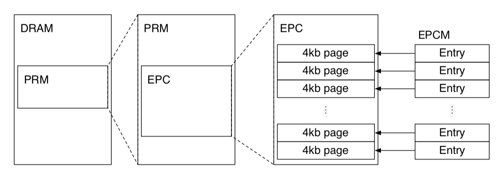
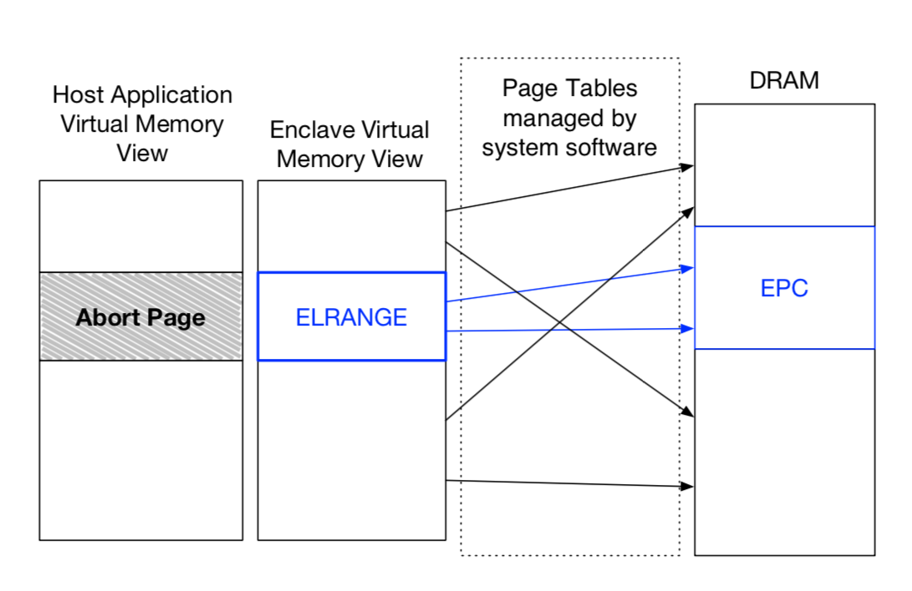
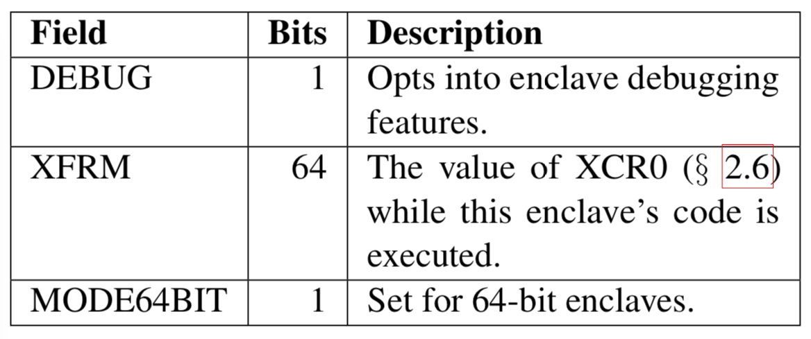
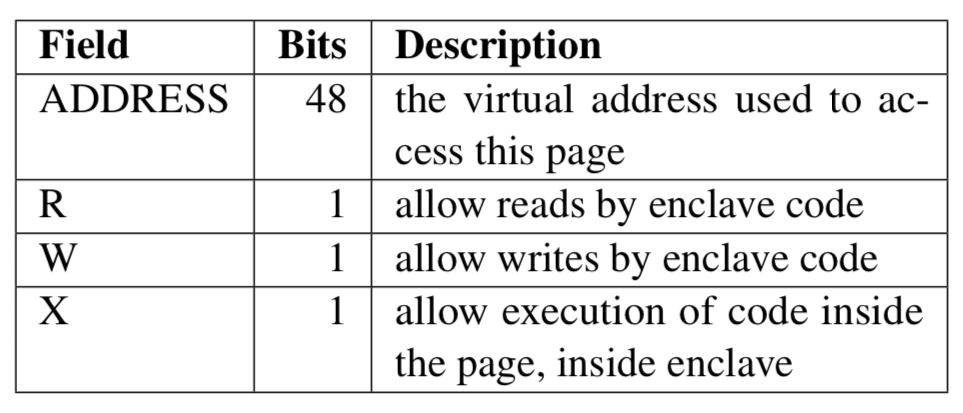
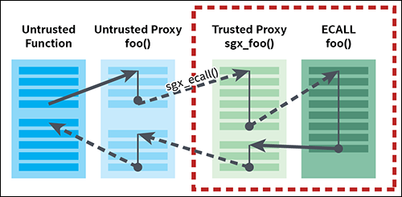
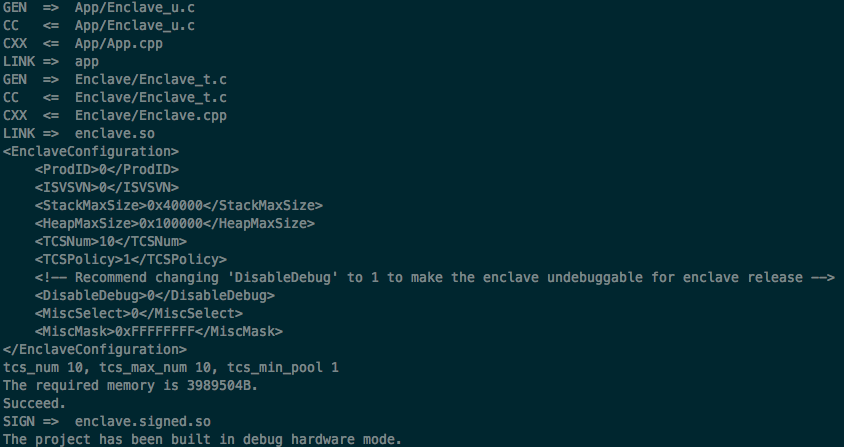

# Enclave

## Physical Memory Organization

The enclave’s code and data is stored in Processor Reserved Memory \(PRM\), which is a subset of DRAM that cannot be directly accessed by other software, including system software and System Management Module code \(Ring 2\). Direct Memory Access targeting the PRM is also rejected by the CPU in order to protect enclave from other peripherals.

### Enclave Page Cache \(EPC\)

The contents of enclaves and the associated data structures are stored in the Enclave Page Cache \(EPC\), which is a subset of the PRM.



The SGX design supports having multiple enclaves on a system at the same time, which is a necessity in multi-process environments. This is achieved by having the EPC split into 4 KB pages that can be assigned to different enclaves. The EPC uses the same page size as the architecture’s address translation feature.

The EPC is managed by the same system software that manages the rest of the computer’s physical memory. The system software, which can be a hypervisor or an OS kernel, uses SGX instructions to allocate unused pages to enclaves, and to free previously allocated EPC pages. Non-enclave software cannot directly access the EPC, as it is contained in the PRM.

### Enclave Page Cache Map \(EPCM\)

The SGX design expects the system software to allocate the EPC pages to enclaves. However, as the system software is not trusted, SGX processors check the correctness of the system software’s allocation decisions, and refuse to perform any action that would compromise SGX’s security guarantees. For example, if the system software attempts to allocate the same EPC page to two enclaves, the SGX instruction used to perform the allocation will fail.

In order to perform its security checks, SGX records some information about the system software’s allocation decisions for each EPC page in the Enclave Page Cache Map \(EPCM\). The EPCM is an array with one entry per EPC page, so computing the address of a page’s EPCM entry only requires a bitwise shift operation and an addition. \(Like the page table in a regular OS\)


Above are the fields in an EPCM entry that track the ownership of pages.

The SGX instructions that allocate an EPC page set the `VALID` bit of the corresponding EPCM entry to `1`, and refuse to operate on EPC pages whose `VALID` bit is already set.

The instruction used to allocate an EPC page also determines the page’s intended usage, which is recorded in the page type \(`PT`\) field of the corresponding EPCM entry. The pages that store an enclave’s code and data are considered to have a regular type \(`PT_REG`\). The pages dedicated to the storage of SGX’s supporting data structures are tagged with special types. For example, the PT\_SECS type identifies pages that hold SGX Enclave Control Structures.

A page’s EPCM entry also identifies the enclave that owns the EPC page. This information is used by the mechanisms that enforce SGX’s isolation guarantees to prevent an enclave from accessing another enclave’s private information. As the EPCM identifies a single owning enclave for each EPC page, it is impossible for enclaves to communicate via shared memory using EPC pages.

### SGX Enclave Control Structure \(SECS\)

SGX stores per-enclave metadata in a SGX Enclave Control Structure \(SECS\) associated with each enclave. Each SECS is stored in a dedicated EPC page with the page type `PT_SECS`. These pages are not intended to be mapped into any enclave’s address space, and are exclusively used by the CPU’s SGX implementation.

An enclave’s identity is almost synonymous to its SECS. The first step in bringing an enclave to life allocates an EPC page to serve as the enclave’s SECS, and the last step in destroying an enclave deallocates the page holding its SECS. The EPCM entry field identifying the enclave that owns an EPC page points to the enclave’s SECS. The system software uses the virtual address of an enclave’s SECS to identify the enclave when invoking SGX instructions.

All SGX instructions take virtual addresses as their inputs. Given that SGX instructions use SECS addresses to identify enclaves, the system software must create entries in its page tables pointing to the SECS of the enclaves it manages. However, the system software cannot access any SECS page, as these pages are stored in the PRM. SECS pages are not intended to be mapped inside their enclaves’ virtual address spaces, and SGX-enabled processors explicitly prevent enclave code from accessing SECS pages.

## Memory Layout of Enclave \(Virtual Memory\)

SGX was designed to minimize the effort required to convert application code to take advantage of enclaves. Therefore, it adopts similar memory address translation mechanism as the system software such as operating system or hypervisor.

### Enclave Linear Address Range \(ELRANGE\)

_\("Linear" roughly means "virtual" in regular memory layout\)_ Each enclave designates an area in its virtual address space, called the enclave linear address range \(ELRANGE\), which is used to map the code and the sensitive data stored in the enclave’s EPC pages. The virtual address space outside ELRANGE is mapped to access non-EPC memory via the same virtual addresses as the enclave’s host process.



The SGX design guarantees that the enclave’s memory accesses inside ELRANGE obey the virtual memory abstraction, while memory accesses outside ELRANGE receive no guarantees \(because system software cannot be trusted\). Therefore, enclaves must store all their code and private data inside ELRANGE, and must consider the memory outside ELRANGE to be an untrusted interface to the outside world.

ELRANGE is specified using a base \(the `BASEADDR` field\) and a size \(the `SIZE`\) in the enclave’s SECS. ELRANGE must meet the same constraints as a variable memory type range and as the PRM range, namely the size must be a power of 2, and the base must be aligned to the size. These restrictions are in place so that the SGX implementation can inexpensively check whether an address belongs to an enclave’s ELRANGE quickly, in either hardware or software.

### SGX Enclave Attributes

The execution environment of an enclave is heavily influenced by the value of the `ATTRIBUTES` field in the enclave’s SECS.



The most important attribute, from a security perspective, is the DEBUG flag. When this flag is set, it enables the use of SGX’s debugging features for this enclave. These debugging features include the ability to read and modify most of the enclave’s memory. Therefore, DEBUG should only be set in a development environment, as it causes the enclave to lose all the SGX security guarantees.

SGX guarantees that enclave code will always run with the XCR0 register set to the value indicated by extended features request mask \(XFRM\). Enclave authors are expected to use XFRM to specify the set of architectural extensions enabled by the compiler used to produce the enclave’s code.

The MODE64BIT flag is set to true for enclaves that use the 64-bit Intel architecture.

The INIT flag is always false when the enclave’s SECS is created. The flag is set to true at a certain point in the enclave lifecycle.

### Address Translation for SGX Enclaves

Under SGX, the operating system and hypervisor are still in full control of the page tables and Extended Page Tables, and each enclave’s code uses the same address translation process and page tables as its host application. This minimizes the amount of changes required to add SGX support to existing system software. At the same time, having the page tables managed by untrusted system software opens SGX up to the address translation attacks.

SGX’s active memory mapping attacks defense mechanisms revolve around ensuring that each EPC page can only be mapped at a specific virtual address. When an EPC page is allocated, its intended virtual address is recorded in the EPCM entry for the page, in the `ADDRESS` field.

When an address translation result is the physical address of an EPC page, the CPU ensures that the virtual address given to the address translation process matches the expected virtual address recorded in the page’s EPCM entry.



SGX also protects against some passive memory mapping attacks and fault injection attacks by ensuring that the access permissions of each EPC page always match the enclave author’s intentions. The access permissions for each EPC page are specified when the page is allocated, and recorded in the readable \(`R`\), writable \(`W`\), and executable \(`X`\) fields in the page’s EPCM entry.

An enclave author must include memory layout information \("page table"\) along with the enclave, in such a way that the system software loading the enclave will know the expected virtual memory address and access permissions for each enclave page. In return, the SGX design guarantees to the enclave authors that the system software, which manages the page tables and Extended Page Table, will not be able to set up an enclave’s virtual address space in a manner that is inconsistent with the author’s expectations.

Finally, a SGX-enabled CPU will ensure that the virtual memory inside ELRANGE is mapped to EPC pages. This prevents the system software from carrying out an address translation attack where it maps the enclave’s entire virtual address space to DRAM pages outside the PRM, which do not trigger any of the checks above, and can be directly accessed by the system software.

## Thread Control Structure \(TCS\)

The SGX design fully supports multi-core processors. It is possible for multiple logical processors to concurrently execute the same enclave’s code at the same time, via different threads.

The SGX implementation uses a Thread Control Structure \(TCS\) for each logical processor that executes an enclave’s code.

Each TCS is stored in a dedicated EPC page whose EPCM entry type is PT\_TCS. Some of the first few fields are considered to belong to the architectural part of the structure, and therefore are guaranteed to have the same semantics on all the processors that support SGX. The rest of the TCS is not documented.

The contents of an EPC page that holds a TCS cannot be directly accessed, even by the code of the enclave that owns the TCS. This restriction is similar to the restriction on accessing EPC pages holding SECS instances. However, the architectural fields in a TCS can be read by enclave debugging instructions.

The architectural fields in the TCS lay out the context switches performed by a logical processor when it transitions between executing non-enclave and enclave code.

### State Save Area \(SSA\)

When the processor encounters a hardware exception, such as an interrupt, while executing the code inside an enclave, it performs a privilege level switch and invokes a hardware exception handler provided by the system software. Before executing the exception handler, however, the processor needs a secure area to store the enclave code execution context, so that the information in the execution context is not revealed to the untrusted system software.

In the SGX design, the area used to store an enclave thread’s execution context while a hardware exception is handled is called a State Save Area \(SSA\). Each TCS references a contiguous sequence of SSAs. The offset of the SSA array \(OSSA\) field specifies the location of the first SSA in the enclave’s virtual address space. The number of SSAs \(NSSA\) field indicates the number of available SSAs.


Each SSA starts at the beginning of an EPC page, and uses up the number of EPC pages that is specified in the SSAFRAMESIZE field of the enclave’s SECS. These alignment and size restrictions most likely simplify the SGX implementation by reducing the number of special cases that it needs to handle.

An enclave thread’s execution context consists of the general-purpose registers \(GPRs\) and the result of the XSAVE instruction. Therefore, the size of the execution context depends on the requested-feature bitmap \(RFBM\) used by to XSAVE. All the code in an enclave uses the same RFBM, which is declared in the XFRM enclave attribute. The number of EPC pages reserved for each SSA, specified in SSAFRAMESIZE, must be large enough to fit the XSAVE output for the feature bitmap specified by XFRM.

SSAs are stored in regular EPC pages, whose EPCM page type is PT\_REG. Therefore, the SSA contents is accessible to enclave software. This opens up possibilities for an enclave exception handler that is invoked by the host application after a hardware exception occurs, and acts upon the information in a SSA.

## Enclave Lifecycle

To initialize an enclave, four of the new CPU instructions provided by SGX architecture are used, each will be provided with a wrapper available for developers’ usage \(will be explained in sample code\):

### ECREATE

An enclave is born when the system software issues the ECREATE instruction, which turns a free EPC page into the SECS for the new enclave.

`ECREATE` copies an SECS structure outside the EPC into an SECS page inside the EPC. The internal structure of SECS is not accessible to software. Software sets the following fields in the source structure: `SECS:BASEADDR`, `SECS:SIZE`, and `ATTRIBUTES`.

`ECREATE` validates the information used to initialize the SECS, and results in a page fault or general protection fault if the information is not valid. `ECREATE` will also fault if SECS target page is in use; already valid; outside the EPC; addresses are not aligned; unused `PAGEINFO` fields are not zero.

### EADD

The system software can use `EADD` instructions to load the initial code and data into the enclave. `EADD` is used to create both TCS pages and regular pages. This function copies a source page from non-enclave memory into the EPC, associates the EPC page with an SECS page residing in the EPC, and stores the linear address and security attributes in EPCM. EADD reads its input data from a Page Information \(`PAGEINFO`\) structure.

#### The PAGEINFO structure contains:

* The virtual address of the EPC page \(`LINADDR`\)
* The virtual address of the non-EPC page whose contents will be copied into the newly allocated EPC page \(`SRCPGE`\)
* A virtual address that resolves to the SECS of the enclave that will own the page \(`SECS`\).
* The virtual address, pointing to a Security Information \(`SECINFO`\) structure, which contains the newly allocated EPC page’s access permissions \(`R, W, X`\) and its EPCM page type \(`RT_REG` or `PT_TCS`\).
* EADD validates its inputs, and modifies the newly allocated EPC page and its EPCM entry.

EADD ensures that the EPC page is not allocated to another enclave, the page’s virtual address falls within the enclave’s ELRANGE and all the reserved fields in `SECINFO` are set to zero.

### EEXTEND

While loading an enclave, the system software will also use the `EEXTEND` instruction, which updates the enclave’s measurement used in the software attestation process. It updates the MRENCLAVE measurement register of an SECS with the measurement of an EXTEND string composed of `EEXTEND || ENCLAVEOFFSET || PADDING || 256 bytes of the enclave page`. RCX register contains the effective address of the 256 byte region of an EPC page to be measured.

### EINIT

This function is the final instruction executed in the enclave build process. After `EINIT`, the `MRENCLAVE` measurement is complete, and the enclave is ready to start user code execution using `EENTER` instruction.

When `EINIT` completes successfully, it sets the enclave’s `INIT` attribute to true. This opens the way for ring 3 application software to execute the enclave’s code, using the SGX instructions. On the other hand, once `INIT` is set to true, `EADD` cannot be invoked on that enclave anymore, so the system software must load all the pages that make up the enclave’s initial state before executing the `EINIT` instruction.

#### Before jumping into design decisions, there are several terms need to be clarified first:

* ECALL: “Enclave Call”, a call made into an interface function within the enclave
* OCALL: “Out Call”, a call made from within the enclave to the outside application
* Trusted: Refers to any code or construct that runs inside an enclave in a “trusted” environment.
* Trusted Thread Context: The context for a thread running inside the enclave. This is composed of:
  * Thread Control Structure \(TCS\)
  * Thread Data/Thread Local Storage: data within the enclave and specific to the thread
  * State Save Area\(SSA\): a data buffer which holds register state when an enclave must exit due to an interrupt or exception
  * Stack: a stack located within the enclave
* Untrusted: Refers to any code or construct that runs in the applications “untrusted” environment \(outside of the enclave\).

#### This is the general approach we’ll follow for designing an application for Intel SGX:

1. Identify the application’s secrets.
2. Identify the providers and consumers of those secrets.
3. Determine the enclave boundary.
4. Tailor the application components for the enclave.

The first step in designing enclave is to identify the assets it needs to protect, the data structures where the assets are contained, and the set of code that operates on those data structures and then place them into a separate trusted library. It is a required step because enclave code is loaded in a special way such that once the enclave has been initialized, privileged code and the rest of the untrusted application cannot directly read data that resides in the protected environment, or change the behavior of the code within the enclave without detection.

After defining the trusted \(enclave\) and untrusted \(application\) components of an Intel SGX enabled application, we should carefully define the interface between untrusted application and enclave. An enclave must expose an API for untrusted code to call in \(ECALLs\) and express what functions provided by the untrusted code are needed \(OCALLs\). Both ECALLs and OCALLs are defined by developers using **Enclave Definition Language** \(EDL\), and they together consist the enclave boundary.

### The Enclave Definition Language

Before moving to the actual enclave code sample, we’ll take a few moments to discuss the Enclave Definition Language \(EDL\) syntax. An enclave’s bridge functions, both its ECALLs and OCALLs, are prototyped in its EDL file and its general structure is as follows:

```text
enclave {
    // Include files
    // Import other edl files
    // Data structure declarations to be used as parameters of the function prototypes in edl

    trusted {
        // Include file if any. It will be inserted in the trusted header file (enclave_t.h)
        // Trusted function prototypes (ECALLs)
    };

    untrusted {
        // Include file if any. It will be inserted in the untrusted header file (enclave_u.h)
        // Untrusted function prototypes (OCALLs)
    };
};
```

**ECALLs** are prototyped in the trusted section, and **OCALLs** are prototyped in the untrusted section.

When the project is built, the Edger8r tool that is included with the Intel SGX SDK parses the EDL file and generates a series of proxy functions. These proxy functions are essentially wrappers around the real functions that are prototyped in the EDL. Each ECALL and OCALL gets a pair of proxy functions: a trusted half and an untrusted half. The trusted functions go into `EnclaveProject_t.h` and `EnclaveProjct_t.c` and are included in the auto-generated Files folder of your enclave project. The untrusted proxies go into `EnclaveProject_u.h` and `EnclaveProject_u.c` and are placed in the auto-generated Files folder of the project that will be interfacing with your enclave.



Your program does not call the ECALL and OCALL functions directly; it calls the proxy functions. When you make an ECALL, you call the untrusted proxy function for the ECALL, which in turn calls the trusted proxy function inside the enclave. That proxy then calls the “real” ECALL and the return value propagates back to the untrusted function. This sequence is shown in the figure above. When you make an OCALL, the sequence is reversed: you call the trusted proxy function for the OCALL, which calls an untrusted proxy function outside the enclave that, in turn, invokes the “real” OCALL.

More details will be explained in the example code.

## Enclave Example

Now let's start with an enclave Hello world coding example.

Code is available under HelloEnclave [here](https://github.com/sangfansh/SGX101_sample_code.git). It is a simplified version of SampleEnclave example at Linux SGX SDK.



 The `App.h` head file defines the application we are going to create. Here, enclave initialization token is define as the `enclave.token` file and the signed enclave shared object after compilation will be `enclave.signed.so` \(line 52, 53\). 

A global `sgx_enclave_id_t` is also declared to uniquely identify the enclave \(line 55\). 

Now let's move to `App.cpp`.



As it is in the untrusted application, we must include `sgx_urts.h`, the SGX untrusted runtime system, for SGX to work correctly with the application. We also include `Enclave_u.h`, which will include all of the ECALL proxies generated from the EDL file after compilation.

Line 48-150 just summarize all the possible error code caused by enclave operation.

The critical function here is `initialize_enclave(void)` at line 157. It first retrieves the launch token from previous transactions if available. If not, just use an empty buffer to record it. Then it calls `sgx_create_enclave()` function provided by urts library to officially initialize the enclave instance. The `sgx_create_enclave()` will performs an implicit ECALL. The implicit ECALL initiates enclave runtime initialization flow described in the Enclave Lifecycle tutorial. The actual enclave instance shared object will be saved as `enclave.signed.so`, which is signed by the CPU as indicated by the filename. And the enclave id will be saved in `global_eid` for future access.

We can ignore the `ocall_print_string()` function as it was in the original sample code.

In the main body of the application, we first initialize the enclave by calling `initialize_enclave()`. Then call our printf\_helloworld\(\) function, which will be discussed later.

Finally, we destroy the enclave instance by calling `sgx_destroy_enclave()` provided by urts library. It will perform the implicit ECALL that performs instructions that destroy the targeted enclave.

Since our purpose of this example application is to print something from the enclave instead from the untrusted application directly, the enclave part should only contain the function that performs this task.



The enclave header file declares the \`printf\_helloworld\(\)\` function, which will be responsible for our purpose. This function call will be protected by the enclave so outside world won't know the secret being processed. But for demonstration purposes, we will just print out the secret from the enclave to the screen by calling this function.



We define the `printf_helloworld()` function as a part of the enclave protected code path, which just prints out `Hello World` to the console. In reality, the secret string should be passed into the enclave from outside world, and will be protected by the enclave. Now since the untrusted application cannot access the enclave content directly, in order for the untrusted function to call enclave functions, we have to rely on the assistance of proxy functions, which will be generated by the Edger8r tool from EDL file after compilation.

#### The proxy functions are responsible for:

* Marshaling data into and out of the enclave
* Placing the return value of the real ECALL or OCALL in an address referenced by a pointer parameter
* Returning the success or failure of the ECALL or OCALL itself as an `sgx_status_t` value

Note that this means each ECALL or OCALL has potentially two return values. There’s the success of the ECALL or OCALL itself, meaning, were we able to successfully enter or exit the enclave, and then the return value of the function being called in the ECALL or OCALL.

Additional arguments will added to the parameter list for each proxy function and the proxy functions now return a type of `sgx_status_t` instead of the original return types. The first additional parameter is the enclave identifier, eid. The second argument to the proxy function is a pointer to an address that will store the return value from the original enclave function if it has a return value. Since our `printf_helloworld()` function does not have a return value, the proxy function generated for it will look like



We can verify that after compiling the whole project.

Therefore, in order to let the `Edger8r` generate the corresponding proxy functions, we put our function `printf_helloworld()` in the trusted section of `Enclave.edl`.



By now, the whole hello world application has acquired all the required parts and should be ready to go.

Compile the project by typing `make` inside project directory. It should output something like this: 

Then execute the application by typing `./app`. `Hello World` should be printed to the console. And the message is coming form within the enclave to the outside world!

We can verify the proxy function generated in `Enclave_u.c` has the signature mentioned above \(line 21\).



Congratulations you have created your first enclave application!

## References:

1. [https://eprint.iacr.org/2016/086.pdf](https://eprint.iacr.org/2016/086.pdf)
2. [https://software.intel.com/en-us/blogs/2016/06/10/overview-of-intel-software-guard-extensions-instructions-and-data-structures](https://software.intel.com/en-us/blogs/2016/06/10/overview-of-intel-software-guard-extensions-instructions-and-data-structures)
3. [https://eprint.iacr.org/2016/086.pdf](https://eprint.iacr.org/2016/086.pdf)
4. [https://download.01.org/intel-sgx/linux-2.2/docs/Intel\_SGX\_Developer\_Reference\_Linux\_2.2\_Open\_Source.pdf](https://download.01.org/intel-sgx/linux-2.2/docs/Intel_SGX_Developer_Reference_Linux_2.2_Open_Source.pdf)
5. [https://software.intel.com/en-us/blogs/2016/06/10/overview-of-intel-software-guard-extensions-instructions-and-data-structures](https://software.intel.com/en-us/blogs/2016/06/10/overview-of-intel-software-guard-extensions-instructions-and-data-structures)
6. [https://insujang.github.io/2017-04-05/intel-sgx-instructions-in-enclave-initialization/](https://insujang.github.io/2017-04-05/intel-sgx-instructions-in-enclave-initialization/)
7. [https://software.intel.com/en-us/blogs/2016/06/10/overview-of-intel-software-guard-extensions-instructions-and-data-structures](https://software.intel.com/en-us/blogs/2016/06/10/overview-of-intel-software-guard-extensions-instructions-and-data-structures)
8. [https://software.intel.com/en-us/articles/software-guard-extensions-tutorial-series-part-3](https://software.intel.com/en-us/articles/software-guard-extensions-tutorial-series-part-3)
9. [https://software.intel.com/en-us/articles/intel-software-guard-extensions-tutorial-part-7-refining-the-enclave](https://software.intel.com/en-us/articles/intel-software-guard-extensions-tutorial-part-7-refining-the-enclave)

